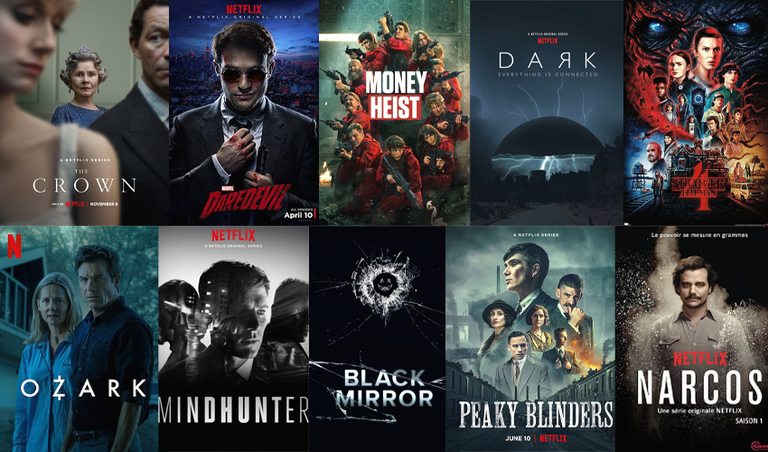

--- 

marp: true
class: invert
backgroundColor: black

---

 
---

# On-demand streaming service
*  Subscription-based 
* Distributes original, acquired films and 
television shows from various genres
    * Variety of award-winning Netflix originals, 
    TV shows, movies, documentaries, and more. 

    

---

# lead competitors
*  Amazon Prime Video 
* Disney + 
*  HBO Max 
* Hulu 
*  Apple TV +

---

# Cost
*  Standards w/ Ads monthy = $5.99  
*  Standard monthy = $16.49
*  Premium monthy = $20.99

# Availability
*  Available in over 190 countries
    *  Each country has their own catalog 
    of movies + TV shows
* Accessible through the app or the website  

---

## Interesting facts
*  Netflix Currently has Just Over 221 Million Subscribers
* Netflix Shares Sell for Around $180 per share 
* Netflix's Current Market Value is around $85 billion
* Netflix was founded in 1997, and the first Netflix subscription plan was introduced in 1999.
 * Blockbuster turned down a deal to buy Netflix 
 * The Netflix headquarter is located in the heart of Silicon Valley near the Los Gatos Creek Trail
 
 
---

# My Top 10:
1. The Crown  
2. Peaky Blinders 
3. Murder Mystery
4.  How to Train your Dragon
5. Fantastic Beasts: Secrets of Dumbledore
6. The Notebook
7. Catch me if you can
8. Enola Homes
9. Now you see me 
10. Gilmore Girls

---

